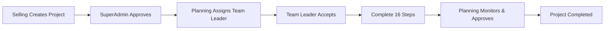

# ☀️ Solar Project Tracking System

A comprehensive project management system designed specifically for solar energy projects, enabling seamless tracking from initial quotation to final documentation.


🔗 **Live Demo:** [https://projecttracking.steelandstyles.com/](https://projecttracking.steelandstyles.com/)

---

## 📋 Table of Contents
- [Overview](#-overview)
- [Key Features](#-key-features)
- [Project Flow](#-project-flow)
- [Role-Based Panels](#-role-based-panels)
- [16-Step Workflow](#-16-step-workflow)
- [Tech Stack](#-tech-stack)
- [Folder Structure](#-folder-structure)
- [Installation & Deployment](#-installation--deployment)
- [API Documentation](#-api-documentation)
- [Database Schema](#-database-schema)
- [PDF Reporting](#-pdf-reporting)
- [Security Rules](#-security-rules)
- [Contributing](#-contributing)
- [License](#-license)

---

## 🎯 Overview
The Solar Project Tracking System is a role-based web application that streamlines the management of solar installation projects. It provides different interfaces for Selling, SuperAdmin, Planning, and Team Leader roles, ensuring each team member has access to the information they need while maintaining data confidentiality.

---

## ✨ Key Features

### Core Functionality
- **Multi-role Authentication**: Secure login for 4 distinct user roles.
- **Project Lifecycle Management**: From creation to completion.
- **16-Step Workflow**: Structured process with sequential and parallel steps.
- **File Management**: Upload, approve, and track documents per step.
- **Deadline Tracking**: Set deadlines with overdue notifications.
- **Delay Reporting**: Team Leaders can report reasons for delays.
- **PDF Reports**: Generate role-specific reports (with/without budget data).
- **Real-time Notifications**: Role-based notification system.
- **Bill of Quantities (BOQ)**: Track project budgets and materials.
- **Todo Lists**: Task management per project.

### Quotation System
- `quotation_admin`: Mandatory quotation for SuperAdmin approval.
- `quotation_planning`: Optional quotation for Planning team.

---

## 🔄 Project Flow



---

## 👥 Role-Based Panels

| Role | Access Level | Key Responsibilities |
| :--- | :--- | :--- |
| **Selling** | Limited | Create projects, upload quotations |
| **SuperAdmin** | Full | Approve projects, assign to leaders, manage users, view all data |
| **Planning** | High | Assign leaders, monitor steps, approve files, set deadlines |
| **Team Leader** | Project-level | Accept/reject projects, complete 16 steps, upload files |

### Access Control Rules
* ✅ Price/Budget **NEVER** shown in TeamLeader or Planning panels.
* ✅ TeamLeader panel has **NO PKR** anywhere in UI.
* ✅ Planning PDF excludes budget/price section.

---

## 📝 16-Step Workflow

### Main Steps (1-8) - Sequential Unlock
| Step | Name | Unlock Condition |
| :--- | :--- | :--- |
| 1 | Survey | Step 1 always unlocked |
| 2 | Design | Step 1 completed |
| 3 | Material Demand | Step 2 completed |
| 4 | Purchase Order | Step 3 completed |
| 5 | Procurement | Step 4 completed |
| 6 | Material Dispatch | Step 5 completed |
| 7 | Material Delivered | Step 6 completed |
| 8 | Execution | Auto-completes when steps 9-16 done |

### Sub-Steps (9-16) - Parallel Unlock
*Unlock simultaneously when Step 7 is completed.*

| Step | Name | Special Feature |
| :--- | :--- | :--- |
| 9 | Mechanical | Has checklist (Base plates, U-Channel, Panels, Civil) |
| 10 | Civil | Standard step |
| 11 | Electric | Standard step |
| 12 | Earthing | Standard step |
| 13 | Load Distribution | Standard step |
| 14 | Commissioning & Testing | Standard step |
| 15 | User Training & Reviews | Standard step |
| 16 | Documentation | Standard step |

---

## 🛠 Tech Stack

**Frontend:**
- React 18 + TypeScript
- Vite, Tailwind CSS
- Axios, jsPDF + autoTable

**Backend:**
- PHP 7.4+ (RESTful API)
- MySQL
- Hosting: cPanel / Hostinger

---

## 📁 Folder Structure
```text
EA_Project_Tracking_System/
├── src/
│   ├── App.tsx                 # Main routing + login check
│   ├── types.ts                # All TypeScript interfaces
│   ├── store.ts                # All async API functions
│   ├── api.ts                  # Axios API calls + base URL detection
│   ├── components/             # UI Dashboards for each role
│   └── utils/                  # PDF + Excel generation
├── backend/
│   ├── config.php              # DB credentials (ONLY file to change for deploy)
│   ├── database.sql            # Fresh DB setup
│   └── api/                    # API Endpoints (auth, projects, steps, etc.)
└── public/                     # Static assets (logo, etc.)
```

---

## 🚀 Installation & Deployment

### Local Development
1. **Clone & Install:**
   ```bash
   git clone https://github.com/ammadzahid/EA_Project_Tracking_System.git
   cd EA_Project_Tracking_System
   npm install
   ```
2. **Configure Backend:**
   Update `backend/config.php` with your local database credentials.
3. **Database:**
   Import `backend/database.sql` into phpMyAdmin.
4. **Run:**
   ```bash
   npm run dev
   ```

---

## 📡 API Documentation
| Endpoint | Method | Description |
| :--- | :--- | :--- |
| `/api/auth.php?action=login` | POST | User login |
| `/api/projects.php?action=list` | GET | Get projects by role |
| `/api/steps.php?action=update` | POST | Update step status |
| `/api/files.php?action=view&id=X` | GET | View file securely |

---

## 🔒 Security Rules
- **Role Verification**: Each API request is checked against the user's session role.
- **Data Isolation**: Database queries are filtered so users only see authorized data.
- **Secure Storage**: Files are stored outside the public directory and accessed via a PHP proxy.

---
